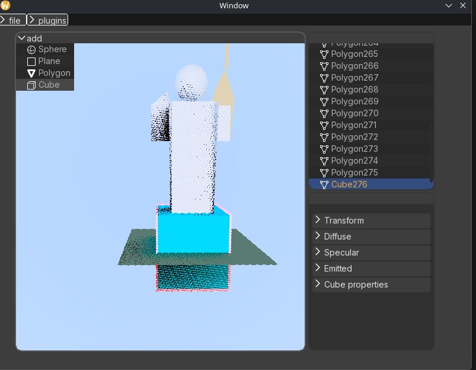
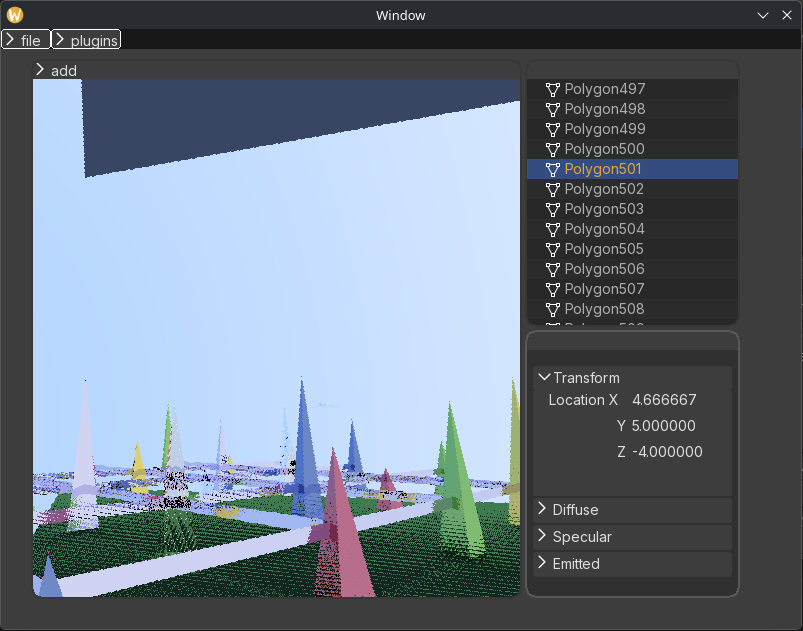
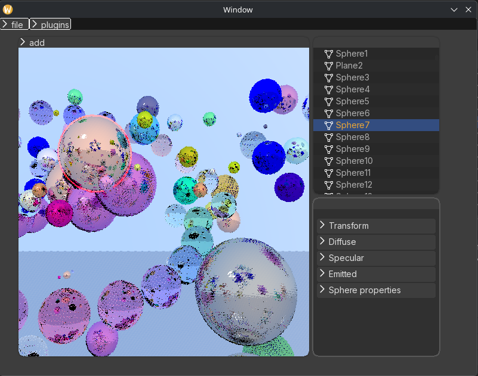

# Examples

  

# Как собрать? 

./release.sh

# Как загрузить сцену? 
После запуска в левом верхнем углу будет кнопка `load`. После нажатия на нее откроется меню с указаниям пути до файла со сценой. 
Пример сцены: `examples/statue`

# Feature: Ctrl + D
Перед нажатием `Ctrl + D` в меню справа сверху есть кнопка `plugins` -> `Add pp plugin`. После нажатия на `Add pp plugin` откроется меню с добавлением плагина дорисовки. 
Пример плагина дорисовки (появится после сборки проекта): `external/plugins/pp/libIADorisovkaPlugin.so` 
После нажатия `Crtl + D` откроется окно дорисовки. 